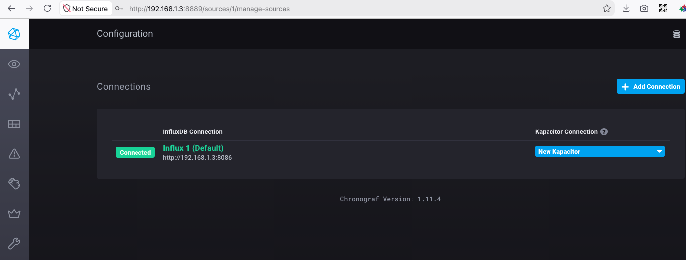
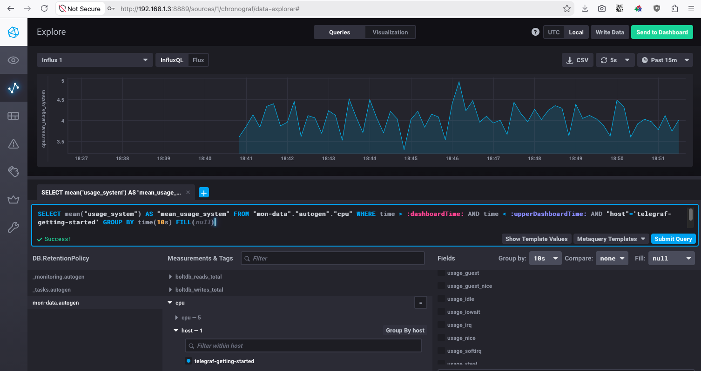
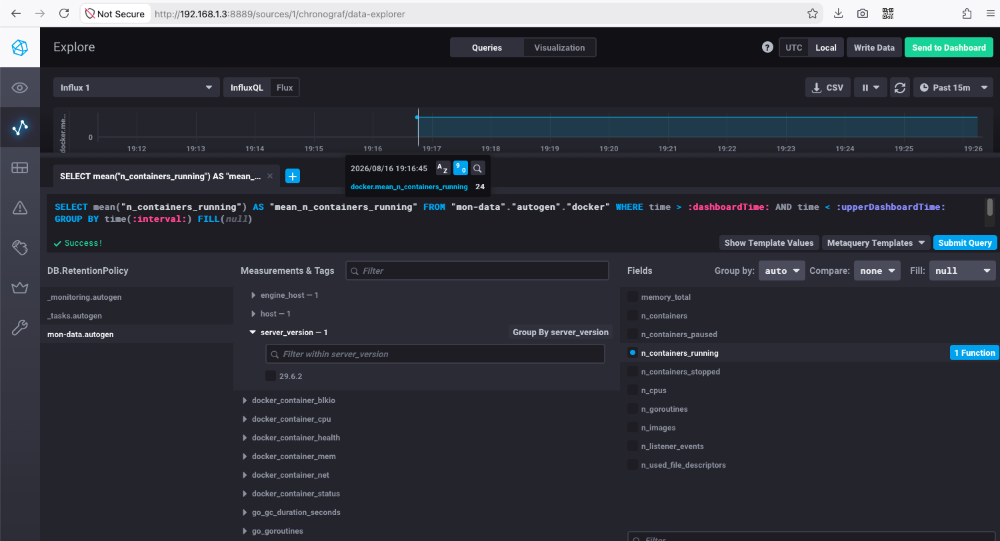
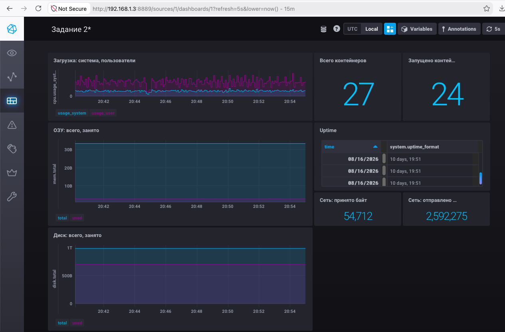

# Домашнее задание к занятию "13.Системы мониторинга"

## Обязательные задания

> 1. Вас пригласили настроить мониторинг на проект. На онбординге вам рассказали, что проект представляет из себя платформу для вычислений с выдачей текстовых отчетов, которые сохраняются на диск. Взаимодействие с платформой осуществляется по протоколу http. Также вам отметили, что вычисления загружают ЦПУ. Какой минимальный набор метрик вы выведите в мониторинг и почему?

### Ответ 1

От чего отталкиваюсь, что необходимо наблюдать:
- системное ПО / ОС - доступность платформы, наличие/дефицит ресурсов, статистика кодов HTTP;
- вычисления - возможно всплески вычислений, если не установлены лимиты на ОЗУ/ЦПУ для процессов/контейнеров, доступность самих процессов/контейнеров;
- результаты в текстовом виде (если в файловом виде, не в БД) - доступность процесса (генератора отчётов), наличие свободного места на разделе складирования отчётов.

То есть необходимы такие метрики:
 - Периодический ping, другой сетевой heart-beat агента. (Пригодится, *если система не слишком сильно нагруженная, есть периоды простоя*, а мониторинг по другим характеристиками редкий, нерегулярный.)
 - Нагрузка на ЦПУ за некоторый период времени.
 - Текущая загрузка объёма ОЗУ (+ свопа, если есть).
 - Свободное место на диске/разделах (генератора отчёта и системного/отдельного с логами системы и ПО платформы, на случай неучтённого катастрофического роста ошибок, системных в том числе, некорректной ротации логов и т.п.).
 - Статус активности процессов/контейнеров приложений платформы вычислений.
 - Статистика HTTP-кодов (как минимум для 4xx/5xx).

#
> 2. Менеджер продукта посмотрев на ваши метрики сказал, что ему непонятно что такое RAM/inodes/CPUla. Также он сказал, что хочет понимать, насколько мы выполняем свои обязанности перед клиентами и какое качество обслуживания. Что вы можете ему предложить?

### Ответ 2

Предложу:
- Определить и задать SLO (максимум того, что сможем обеспечить), SLA (обязанности перед клиентами, которые сможем гарантировать), SLI (какое качество обслуживания фактически обеспечиваем).
- Совместно выработать формулу расчёта этих интегральных показателей из RAM/inodes/CPUla/т.п., перевести эти метрики на обобщённый язык доступности сервиса клиентам и для внутреннего мониторинга/аудита.

#
> 3. Вашей DevOps команде в этом году не выделили финансирование на построение системы сбора логов. Разработчики в свою очередь хотят видеть все ошибки, которые выдают их приложения. Какое решение вы можете предпринять в этой ситуации, чтобы разработчики получали ошибки приложения?

### Ответ 3

Опционально, нетехническое решение:
- Буду настаивать на выделении бюджета, если ресурсов нет, а сбор логов имеет **вес критической задачи для бизнеса в том числе** (например, в момент запуска нового приложения, в период активного роста, сезонной активности/нагрузки).
- Также выясню, что значит "не выделили финансирование" - если не выделено время на соответствующие работы специалистов, тогда также буду настаивать на перераспределении бюджета работ и выделении времени на построение системы. Иначе даже при наличии аппаратных ресурсов, команда DevOps не обеспечит мониторинг приложений.

Ближе к теме курса с технической стороны:
- Обсужу с разработчиками/тимлидом, какие ошибки / зоны контроля наиболее критичны, чтобы отключить менее важную часть параметров/метрик, включаемых в логи. Например, чтобы перестать логировать отладочную телеметрию, которая может избыточно дублировать другие логи. Предложу пользоваться логами своего ПО, если это возможно без заметной потери observability. Постараюсь грохнуть виртуалки и контейнеры для похожих, дублирующихся задач (сэкономить также ресурсы ЦПУ и ОЗУ).
- К разговору могу добавить статистику по занятому данными телеметрии/отладки дисковому пространству, по нагрузке на контейнеры или виртуалки в "песочнице", если они базируются в том же облаке или т.п.
- Разверну систему мониторинга и сбора логов на высвободившихся ресурсах. 

#
> 4. Вы, как опытный SRE, сделали мониторинг, куда вывели отображения выполнения SLA=99% по http кодам ответов. Вычисляете этот параметр по следующей формуле: summ_2xx_requests/summ_all_requests. Данный параметр не поднимается выше 70%, но при этом в вашей системе нет кодов ответа 5xx и 4xx. Где у вас ошибка?

### Ответ 4

Ошибка в том, что описанным в условии способом я вычисляю не SLA, а скорее SLI. То есть оцениваю для нас, как мы фактически отработали.
Чтобы производить мониторинг SLA, в простейшем случае мне нужно вывести отображение расчёта сбоев - HTTP-кодов 5xx и 4xx. Вот за них мы должны производить компенсацию клиентам.

#
> 5. Опишите основные плюсы и минусы pull и push систем мониторинга.

### Ответ 5

Плюсы push:
- Можно одновременно отправлять данные в несколько систем.
- Обычно отправка через UDP - меньше накладных расходов (выше производительность).
- Можно отправлять данные не в момент появления информации/метрик, а, скажем, раз в день архивом, пачкой, отчётом, т.п.

Плюсы pull:
- Выше достоверность и целостность данных.
- Проще координировать сбор данных (соотносить вес/важность информации от узла, запрашивать узлы при необходимости, а не регулярно, и т.д.). Централизация управления.
- Проще отлаживать - предсказуемость момента получения и доступность запрашиваемых данных.
- Дифференциация мониторинга по типу канала связи - локальные высоконагруженные компоненты системы можно мониторить с миллисекундными интервалами, распределённо-удалённые узлы можно мониторить реже и с учётом накладных расходов / задержек для каждого типа канала.

Минусы push:
- Если необходимо поменять точку сбора информации (реквизиты центрального узла мониторинга), придётся переконфигурировать каждого агента. Иногда это крайне трудно/затратно, особенно, если на обслуживании узлы в нескольких часовых поясах, в сотнях удалённых объектов, т.п.
- Можно *положить* **низкоскоростной канал** связи (из личного опыта - геостационарный спутниковый, 2G, другой с высокими задержками и/или узкой полосой), если через него **постоянно/регулярно** собираем данные с большого количества агентов, не (рас)синхронизированных между собой или в случае каскада сбоев (большого наплыва событий). В итоге забьём канал и потеряем наблюдаемость инфраструктуры / распределённой системы.

Минусы pull:
- Отсутствие heart-beat, то есть, возможны интервалы неопределённости статуса - непонятно, наблюдаемая система недоступна или просто не отправляет данные в систему мониторинга.
- Если удалённый узел за NAT, его невозможно мониторить (по умолчанию без проброса портов, маршрутизации).
- Если в системе есть разовые или временные процессы, то есть, не запущенные постоянно и детерминировано, мы можем не отследить интервал мониторинга - момент запуска и останова такого процесса. То есть, мы не знаем интервал времени, когда их надо наблюдать. Например, непонятно, когда корректно, что такой процесс не запущен, а когда это сбой.

#
> 6. Какие из ниже перечисленных систем относятся к push модели, а какие к pull? А может есть гибридные?
>     - Prometheus 
>     - TICK
>     - Zabbix
>     - VictoriaMetrics
>     - Nagios

### Ответ 6

- Prometheus - **pull**, у него концепция scrape.
- TICK - наверное, всё-таки **push**, так как Telegraf собирает метрики и отправляет их в InfluxDB.
- Zabbix - точно и то, и другое - **push + pull**.
- VictoriaMetrics, push больше, но я бы ответил, что как Zabbix может и **push**, и **pull**.
- Nagios - очень древний, в основном **pull**. Но, вот поскольку древниЙ, то в какой-то момент добавили passive checks. То есть - **гибрид**.

Вообще, по наблюдениям, зрелые системы практически все гибридные за счёт плагинов или т.п. модулей/надстроек.

#
> 7. Склонируйте себе [репозиторий](https://github.com/influxdata/sandbox/tree/master) и запустите TICK-стэк, используя технологии docker и docker-compose.

> В виде решения на это упражнение приведите скриншот веб-интерфейса ПО chronograf (`http://localhost:8888`). 

> P.S.: если при запуске некоторые контейнеры будут падать с ошибкой - проставьте им режим `Z`, например
> `./data:/var/lib:Z`

### Ответ 7



#
> 8. Перейдите в веб-интерфейс Chronograf (http://localhost:8888) и откройте вкладку Data explorer.
>         
>     - Нажмите на кнопку Add a query
>     - Изучите вывод интерфейса и выберите БД telegraf.autogen
>     - В `measurments` выберите cpu->host->telegraf-getting-started, а в `fields` выберите usage_system. Внизу появится график утилизации cpu.
>     - Вверху вы можете увидеть запрос, аналогичный SQL-синтаксису. Поэкспериментируйте с запросом, попробуйте изменить группировку и интервал наблюдений.

> Для выполнения задания приведите скриншот с отображением метрик утилизации cpu из веб-интерфейса.

### Ответ 8



#
> 9. Изучите список [telegraf inputs](https://github.com/influxdata/telegraf/tree/master/plugins/inputs). 
> Добавьте в конфигурацию telegraf следующий плагин - [docker](https://github.com/influxdata/telegraf/tree/master/plugins/inputs/docker):
> ```
> [[inputs.docker]]
>   endpoint = "unix:///var/run/docker.sock"
> ```

> Дополнительно вам может потребоваться донастройка контейнера telegraf в `docker-compose.yml` дополнительного volume и 
> режима privileged:
> ```
>   telegraf:
>     image: telegraf:1.4.0
>     privileged: true
>     volumes:
>       - ./etc/telegraf.conf:/etc/telegraf/telegraf.conf:Z
>       - /var/run/docker.sock:/var/run/docker.sock:Z
>     links:
>       - influxdb
>     ports:
>       - "8092:8092/udp"
>       - "8094:8094"
>       - "8125:8125/udp"
> ```

> После настройке перезапустите telegraf, обновите веб интерфейс и приведите скриншотом список `measurments` в 
> веб-интерфейсе базы telegraf.autogen . Там должны появиться метрики, связанные с docker.

> Факультативно можете изучить какие метрики собирает telegraf после выполнения данного задания.

### Ответ 9



## Дополнительное задание (со звездочкой*) - необязательно к выполнению

> 1. Вы устроились на работу в стартап. На данный момент у вас нет возможности развернуть полноценную систему мониторинга, и вы решили самостоятельно написать простой python3-скрипт для сбора основных метрик сервера. Вы, как опытный системный-администратор, знаете, что системная информация сервера лежит в директории `/proc`. 
> Также, вы знаете, что в системе Linux есть  планировщик задач cron, который может запускать задачи по расписанию.

> Суммировав все, вы спроектировали приложение, которое:
> - является python3 скриптом
> - собирает метрики из папки `/proc`
> - складывает метрики в файл 'YY-MM-DD-awesome-monitoring.log' в директорию /var/log 
> (YY - год, MM - месяц, DD - день)
> - каждый сбор метрик складывается в виде json-строки, в виде:
>   + timestamp (временная метка, int, unixtimestamp)
>   + metric_1 (метрика 1)
>   + metric_2 (метрика 2)
>      ...
>   + metric_N (метрика N)
>   
> - сбор метрик происходит каждую 1 минуту по cron-расписанию

> Для успешного выполнения задания нужно привести:

> а) работающий код python3-скрипта,
> б) конфигурацию cron-расписания,
> в) пример верно сформированного 'YY-MM-DD-awesome-monitoring.log', имеющий не менее 5 записей,

> P.S.: количество собираемых метрик должно быть не менее 4-х.
> P.P.S.: по желанию можно себя не ограничивать только сбором метрик из `/proc`.

### Ответ 1*

> 2. В веб-интерфейсе откройте вкладку `Dashboards`. Попробуйте создать свой dashboard с отображением:

>     - утилизации ЦПУ
>     - количества использованного RAM
>     - утилизации пространства на дисках
>     - количество поднятых контейнеров
>     - аптайм
>     - ...
>     - фантазируйте)
    
    ---

### Ответ 2*

Не слишком оригинальная панель, но показывающая разные:
- типы источников данных,
- варианты виджетов.



### Как оформить ДЗ?

Выполненное домашнее задание пришлите ссылкой на .md-файл в вашем репозитории.

---
