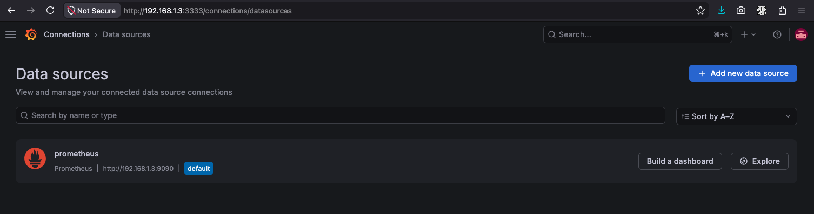
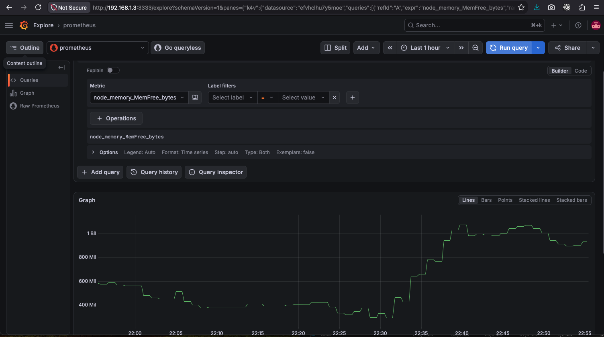
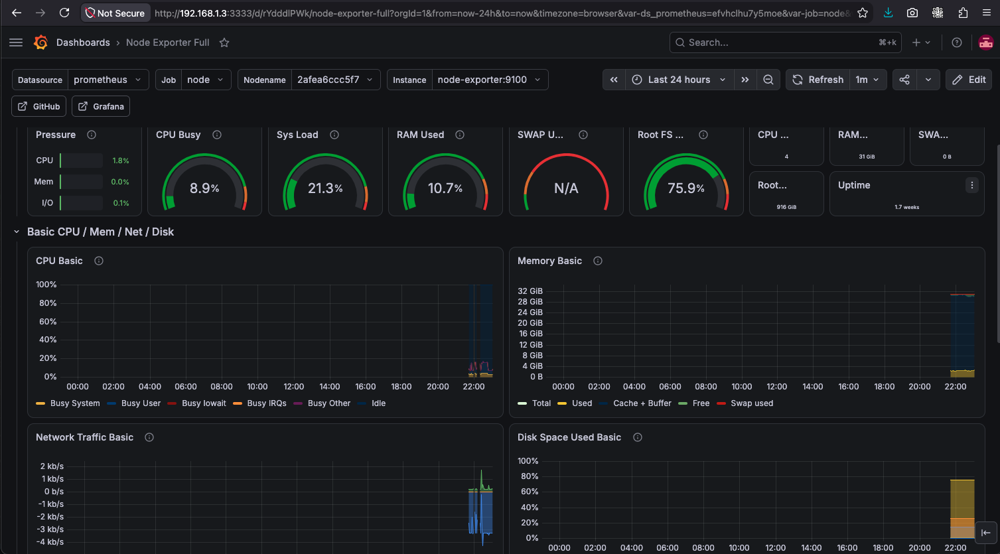
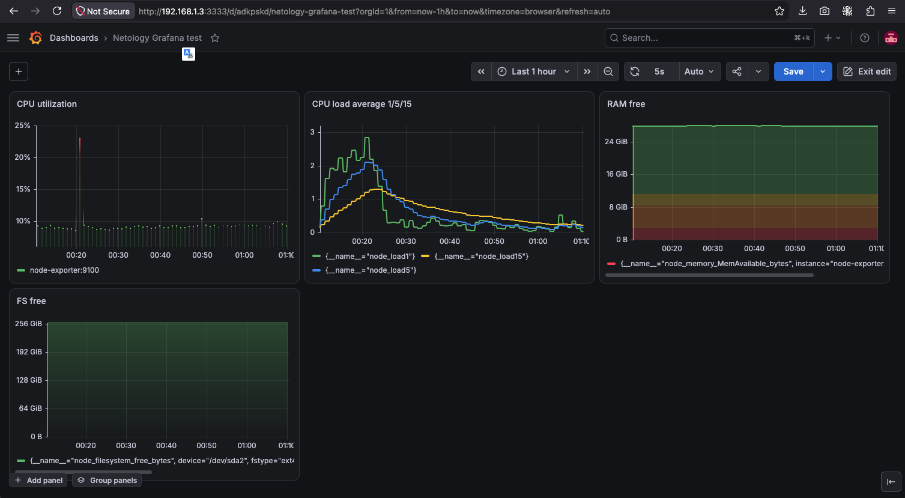
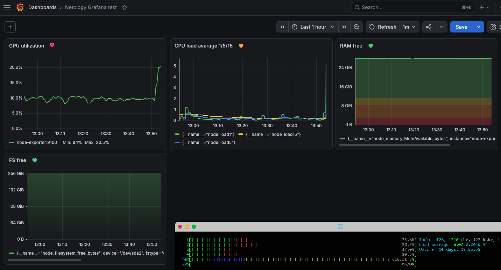
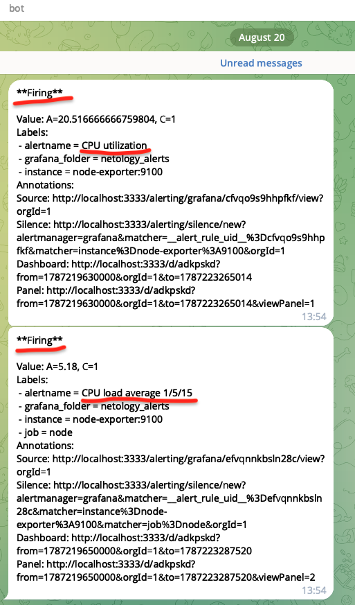
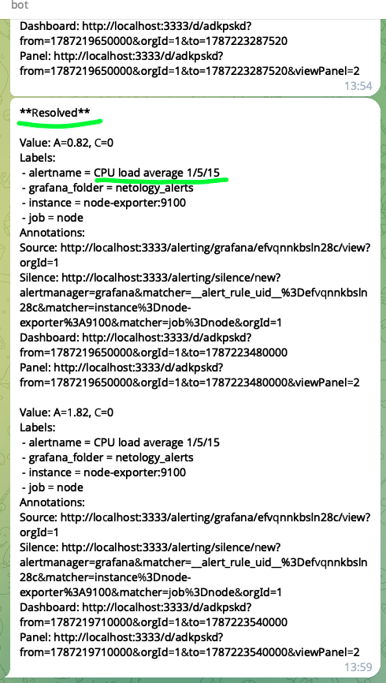

# Домашнее задание к занятию 14 «Средство визуализации Grafana»

## Личный комментарий перед ответами на ДЗ

Вообще, большинство заданий модуля - условно повышенной сложности. :)

Имею в виду, что недостаточно понять информацию из лекции, важно адаптировать её к реальности на момент обучения, сдачи ДЗ.

Лекция с конкретными hints & tips записана 4 года назад. По ним невозможно сделать проект "в лоб". Чтобы реализовать ДЗ, нужно дополнительное время к домашке (это и есть повышенная сложность в реальной жизни работающего студента), чтобы изучить актуальные инструкции и руководства и понять:
- какие изменения в разных модулях ПО произведены с тех пор,
- как эти изменения увязать (найти совместимые версии, новые, изменённые, deprecated настройки), адаптировать для сборки и успешного запуска проекта.

Вот на эти поиски, а не на усвоение ядра темы и нужна куча времени**. Понятно, что такая практика сразу помещает студента в реальные условия будущей работы. Но выбор **дополнительного времени** для изучения изменений внешних зависимостей - уже задание со звёздочкой для начинающего.

Другими словами: в лекциях нет сверхсложного. Но если опираться на лекции, презентации, то решить задания "в лоб" не получится. Нужно обязательно гуглить актуальные мануалы и примеры.

Навскидку из самого очевидного, простого:
- `docker-compose` давно уже `docker compose`.
- Параметр `version` для `compose`-конфигурации устарел и не используется.

## Задание повышенной сложности

> **При решении задания 1** не используйте директорию [help](./help) для сборки проекта. Самостоятельно разверните grafana, где в роли источника данных будет выступать prometheus, а сборщиком данных будет node-exporter:
> - grafana;
> - prometheus-server;
> - prometheus node-exporter.
> 
> За дополнительными материалами можете обратиться в официальную документацию grafana и prometheus.
> В решении к домашнему заданию также приведите все конфигурации, скрипты, манифесты, которые вы использовали в процессе решения задания.

### Ответ 1*

Обратился к официальной документации, поискал по ключу `docker`. Нашёл cледующие материалы на сайте Grafana:
- [Run Grafana Docker image](https://grafana.com/docs/grafana/latest/setup-grafana/installation/docker/),
- [Monitoring a Linux host with Prometheus, Node Exporter, and Docker Compose](https://grafana.com/docs/grafana-cloud/observe-and-act/send-data/metrics/metrics-prometheus/prometheus-config-examples/docker-compose-linux/), тут про Grafana Cloud, но в целом подсмотреть можно,
- [Node Exporter Full](https://grafana.com/grafana/dashboards/1860-node-exporter-full/) - заодно установил посмотреть популярный дашборд.

Объединил информацию в общий `docker-compose.yml`, также добавил конфигурацию Prometheus:
- `docker-compose.yml`
```yaml
services:

  grafana:
    image: grafana/grafana
    container_name: grafana
    restart: unless-stopped
    network_mode: host  # <-- Временный костыль для доступа к Telegram.
    # Прокси до места, где TG API доступен,
    # запускал через локальный SSH-туннель снаружи окружения docker,
    # туда и выносил контейнер.
    environment:
       - HTTPS_PROXY=socks5://127.0.0.1:1080
       - HTTP_PROXY=socks5://127.0.0.1:1080
       - ALL_PROXY=socks5://127.0.0.1:1080
       - NO_PROXY=localhost,127.0.0.1
       - GF_SERVER_HTTP_PORT=3333
#    ports:    # Порт 3000 занят, запускаю на 3333.
#      - '3333:3000'
    volumes:
      - './grafana:/var/lib/grafana'

  node-exporter:
    image: prom/node-exporter:latest
    container_name: node-exporter
    restart: unless-stopped
    volumes:
      - /proc:/host/proc:ro
      - /sys:/host/sys:ro
      - /:/rootfs:ro
    command:
      - '--path.procfs=/host/proc'
      - '--path.rootfs=/rootfs'
      - '--path.sysfs=/host/sys'
      - '--collector.filesystem.mount-points-exclude=^/(sys|proc|dev|host|etc)($$|/)'
    ports:
      - "9100:9100"

  prometheus:
    image: prom/prometheus:latest
    container_name: prometheus
    restart: unless-stopped
    volumes:
      - ./prometheus.yml:/etc/prometheus/prometheus.yml
      - ./prometheus:/prometheus
    command:
      - '--config.file=/etc/prometheus/prometheus.yml'
      - '--storage.tsdb.path=/prometheus'
      - '--web.console.libraries=/etc/prometheus/console_libraries'
      - '--web.console.templates=/etc/prometheus/consoles'
      - '--web.enable-lifecycle'
    ports:
      - "9090:9090"
```
- `prometheus.yml`
```yaml
global:
  scrape_interval: 1m

scrape_configs:
  - job_name: 'prometheus'
    scrape_interval: 10s
    static_configs:
      - targets: ['localhost:9090']

  - job_name: 'node'
    static_configs:
      - targets: ['node-exporter:9100']
```

---

> **При решении задания 3** вы должны самостоятельно завести удобный для вас канал нотификации, например, Telegram или email, и отправить туда тестовые события.
> 
> В решении приведите скриншоты тестовых событий из каналов нотификаций.

### Ответ 3*

Воспользовался материалами из [Grafana Alerting ](https://grafana.com/docs/grafana/latest/alerting/). Настроил уведомления через Telegram. Само решение см. ниже в разделе "Ответ 3" (без звёздочки).

## Обязательные задания

## Задание 1

> 1. Используя директорию [help](./help) внутри этого домашнего задания, запустите связку prometheus-grafana.
> 1. Зайдите в веб-интерфейс grafana, используя авторизационные данные, указанные в манифесте docker-compose.
> 1. Подключите поднятый вами prometheus, как источник данных.
> 1. Решение домашнего задания — скриншот веб-интерфейса grafana со списком подключенных Datasource.

### Ответ 1

1. В директорию help не заглядывал ради чистоты эксперимента, чтобы:
   - новые данные прошли через руки и осели в голове после поиска информации в мануалах и проб с ошибками,
   - понять, что в итоге выйдет при самостоятельной работе / поиске решения.
2. Зашёл на веб-интерфейс Grafana с учёткой по умолчанию (`admin` / `admin`) и поменял пароль на новый по требованию системы.
3. Prometheus в настройках моей Grafana - первый и единственный источник данных.
4. Это видно на скриншоте:


Ниже см. доп. скриншоты.

- Ручной запрос метрики:

- Импортированная панель Node Exporter Full, встречавшиеся в лекционных материалах:


## Задание 2

> Изучите самостоятельно ресурсы:
> 
> 1. [PromQL tutorial for beginners and humans](https://valyala.medium.com/promql-tutorial-for-beginners-9ab455142085).
> 1. [Understanding Machine CPU usage](https://www.robustperception.io/understanding-machine-cpu-usage).
> 1. [Introduction to PromQL, the Prometheus query language](https://grafana.com/blog/2020/02/04/introduction-to-promql-the-prometheus-query-language/).
>
> Создайте Dashboard и в ней создайте Panels:
>
> - утилизация CPU для nodeexporter (в процентах, 100-idle);
> - CPULA 1/5/15;
> - количество свободной оперативной памяти;
> - количество места на файловой системе.
>
> Для решения этого задания приведите promql-запросы для выдачи этих метрик, а также скриншот получившейся Dashboard.

### Ответ 2

#### Запросы

- Утилизация CPU для `node_exporter` (в процентах, 100-idle)
```
100 - (avg by (instance) (rate(node_cpu_seconds_total{job="node",mode="idle"}[90s])) * 100)
```
- CPU load average 1/5/15
```
{__name__=~"node_load(1|5|15)"}
```
- Количество свободной оперативной памяти (взял метрику _доступной_ памяти, а не свободной, поскольку свободной памяти всегда почти нет; объём ОЗУ в любой ОС почти моментально съедается под кэш, особенно файловый).
```
node_memory_MemAvailable_bytes
```
- Количество свободного места в корневом разделе
```
node_filesystem_free_bytes{mountpoint="/"}
```
#### Скриншот



## Задание 3

> 1. Создайте для каждой Dashboard подходящее правило alert — можно обратиться к первой лекции в блоке «Мониторинг».
> 1. В качестве решения задания приведите скриншот вашей итоговой Dashboard.

### Ответ 3

#### Скриншоты

Панели с настроенными и активными алертами + `htop` для сравнения мониторинга нагрузки на ЦПУ:


Сообщения в Telergam об активации и сбросе алертов о повышенной нагрузке на ЦПУ:



## Задание 4

> 1. Сохраните ваш Dashboard.Для этого перейдите в настройки Dashboard, выберите в боковом меню «JSON MODEL». Далее скопируйте отображаемое json-содержимое в отдельный файл и сохраните его.
> 1. В качестве решения задания приведите листинг этого файла.

### Ответ 4

```json
{
  "apiVersion": "dashboard.grafana.app/v2",
  "kind": "Dashboard",
  "metadata": {
    "name": "adkpskd",
    "namespace": "default",
    "uid": "07bc0366-3978-4ff1-8bc2-79b270c4a5de",
    "resourceVersion": "1787222920784989",
    "generation": 32,
    "creationTimestamp": "2026-08-17T20:11:29Z",
    "labels": {
      "grafana.app/deprecatedInternalID": "4278401555968000"
    },
    "annotations": {
      "grafana.app/createdBy": "user:dfvhaaqy8ugowe",
      "grafana.app/saved-from-ui": "Grafana v13.1.3 (45a27d64b6)",
      "grafana.app/updatedBy": "user:dfvhaaqy8ugowe",
      "grafana.app/updatedTimestamp": "2026-08-20T10:48:40Z"
    }
  },
  "spec": {
    "annotations": [],
    "cursorSync": "Off",
    "editable": true,
    "elements": {
      "panel-1": {
        "kind": "Panel",
        "spec": {
          "id": 1,
          "title": "CPU utilization",
          "description": "",
          "links": [],
          "data": {
            "kind": "QueryGroup",
            "spec": {
              "queries": [
                {
                  "kind": "PanelQuery",
                  "spec": {
                    "query": {
                      "kind": "DataQuery",
                      "group": "prometheus",
                      "version": "v0",
                      "datasource": {
                        "name": "efvhclhu7y5moe"
                      },
                      "spec": {
                        "editorMode": "code",
                        "exemplar": false,
                        "expr": "100 - (avg by (instance) (rate(node_cpu_seconds_total{job=\"node\",mode=\"idle\"}[90s])) * 100)",
                        "legendFormat": "__auto",
                        "range": true
                      }
                    },
                    "refId": "A",
                    "hidden": false
                  }
                }
              ],
              "transformations": [],
              "queryOptions": {}
            }
          },
          "vizConfig": {
            "kind": "VizConfig",
            "group": "timeseries",
            "version": "13.1.3",
            "spec": {
              "options": {
                "annotations": {
                  "clustering": -1,
                  "lines": {
                    "width": 2
                  },
                  "multiLane": false,
                  "regions": {
                    "opacity": 0.1
                  }
                },
                "legend": {
                  "calcs": [
                    "min",
                    "max"
                  ],
                  "displayMode": "list",
                  "enableFacetedFilter": false,
                  "overflow": "ellipsis",
                  "placement": "bottom",
                  "showLegend": true
                },
                "tooltip": {
                  "hideZeros": false,
                  "mode": "single",
                  "sort": "none"
                }
              },
              "fieldConfig": {
                "defaults": {
                  "unit": "percent",
                  "decimals": 1,
                  "min": 0,
                  "thresholds": {
                    "mode": "percentage",
                    "steps": [
                      {
                        "value": 0,
                        "color": "green"
                      },
                      {
                        "value": 75,
                        "color": "#EAB839"
                      },
                      {
                        "value": 85,
                        "color": "red"
                      }
                    ]
                  },
                  "color": {
                    "mode": "palette-classic"
                  },
                  "custom": {
                    "axisBorderShow": false,
                    "axisCenteredZero": false,
                    "axisColorMode": "text",
                    "axisLabel": "",
                    "axisPlacement": "auto",
                    "barAlignment": 0,
                    "barWidthFactor": 0.6,
                    "drawStyle": "line",
                    "fillOpacity": 0,
                    "gradientMode": "none",
                    "hideFrom": {
                      "legend": false,
                      "tooltip": false,
                      "viz": false
                    },
                    "insertNulls": false,
                    "lineInterpolation": "linear",
                    "lineStyle": {
                      "fill": "solid"
                    },
                    "lineWidth": 2,
                    "pointSize": 5,
                    "scaleDistribution": {
                      "type": "linear"
                    },
                    "showPoints": "auto",
                    "showValues": false,
                    "spanNulls": true,
                    "stacking": {
                      "group": "A",
                      "mode": "none"
                    },
                    "thresholdsStyle": {
                      "mode": "off"
                    }
                  }
                },
                "overrides": []
              }
            }
          }
        }
      },
      "panel-2": {
        "kind": "Panel",
        "spec": {
          "id": 2,
          "title": "CPU load average 1/5/15",
          "description": "",
          "links": [],
          "data": {
            "kind": "QueryGroup",
            "spec": {
              "queries": [
                {
                  "kind": "PanelQuery",
                  "spec": {
                    "query": {
                      "kind": "DataQuery",
                      "group": "prometheus",
                      "version": "v0",
                      "datasource": {
                        "name": "efvhclhu7y5moe"
                      },
                      "spec": {
                        "editorMode": "code",
                        "expr": "{__name__=~\"node_load(1|5|15)\"}",
                        "legendFormat": "__auto",
                        "range": true
                      }
                    },
                    "refId": "A",
                    "hidden": false
                  }
                }
              ],
              "transformations": [],
              "queryOptions": {}
            }
          },
          "vizConfig": {
            "kind": "VizConfig",
            "group": "timeseries",
            "version": "13.1.3",
            "spec": {
              "options": {
                "annotations": {
                  "clustering": -1,
                  "multiLane": false
                },
                "legend": {
                  "calcs": [],
                  "displayMode": "list",
                  "enableFacetedFilter": false,
                  "overflow": "ellipsis",
                  "placement": "bottom",
                  "showLegend": true
                },
                "tooltip": {
                  "hideZeros": false,
                  "mode": "single",
                  "sort": "none"
                }
              },
              "fieldConfig": {
                "defaults": {
                  "thresholds": {
                    "mode": "absolute",
                    "steps": [
                      {
                        "value": 0,
                        "color": "green"
                      },
                      {
                        "value": 80,
                        "color": "red"
                      }
                    ]
                  },
                  "color": {
                    "mode": "palette-classic",
                    "seriesBy": "max"
                  },
                  "custom": {
                    "axisBorderShow": true,
                    "axisCenteredZero": false,
                    "axisColorMode": "text",
                    "axisLabel": "",
                    "axisPlacement": "auto",
                    "barAlignment": 0,
                    "barWidthFactor": 0.9,
                    "drawStyle": "line",
                    "fillOpacity": 0,
                    "gradientMode": "none",
                    "hideFrom": {
                      "legend": false,
                      "tooltip": false,
                      "viz": false
                    },
                    "insertNulls": false,
                    "lineInterpolation": "smooth",
                    "lineStyle": {
                      "fill": "solid"
                    },
                    "lineWidth": 2,
                    "pointSize": 1,
                    "scaleDistribution": {
                      "type": "linear"
                    },
                    "showPoints": "always",
                    "showValues": false,
                    "spanNulls": false,
                    "stacking": {
                      "group": "A",
                      "mode": "none"
                    },
                    "thresholdsStyle": {
                      "mode": "off"
                    }
                  }
                },
                "overrides": []
              }
            }
          }
        }
      },
      "panel-3": {
        "kind": "Panel",
        "spec": {
          "id": 3,
          "title": "RAM free",
          "description": "",
          "links": [],
          "data": {
            "kind": "QueryGroup",
            "spec": {
              "queries": [
                {
                  "kind": "PanelQuery",
                  "spec": {
                    "query": {
                      "kind": "DataQuery",
                      "group": "prometheus",
                      "version": "v0",
                      "datasource": {
                        "name": "efvhclhu7y5moe"
                      },
                      "spec": {
                        "editorMode": "code",
                        "expr": "node_memory_MemAvailable_bytes",
                        "legendFormat": "__auto",
                        "range": true
                      }
                    },
                    "refId": "A",
                    "hidden": false
                  }
                }
              ],
              "transformations": [],
              "queryOptions": {}
            }
          },
          "vizConfig": {
            "kind": "VizConfig",
            "group": "timeseries",
            "version": "13.1.3",
            "spec": {
              "options": {
                "annotations": {
                  "clustering": -1,
                  "multiLane": false
                },
                "legend": {
                  "calcs": [],
                  "displayMode": "list",
                  "enableFacetedFilter": false,
                  "overflow": "ellipsis",
                  "placement": "bottom",
                  "showLegend": true
                },
                "tooltip": {
                  "hideZeros": false,
                  "mode": "single",
                  "sort": "none"
                }
              },
              "fieldConfig": {
                "defaults": {
                  "unit": "bytes",
                  "thresholds": {
                    "mode": "percentage",
                    "steps": [
                      {
                        "value": 0,
                        "color": "red"
                      },
                      {
                        "value": 10,
                        "color": "orange"
                      },
                      {
                        "value": 30,
                        "color": "yellow"
                      },
                      {
                        "value": 40,
                        "color": "green"
                      }
                    ]
                  },
                  "color": {
                    "mode": "thresholds",
                    "seriesBy": "last"
                  },
                  "custom": {
                    "axisBorderShow": true,
                    "axisCenteredZero": false,
                    "axisColorMode": "text",
                    "axisLabel": "",
                    "axisPlacement": "auto",
                    "axisSoftMin": 0,
                    "barAlignment": 0,
                    "barWidthFactor": 0.6,
                    "drawStyle": "line",
                    "fillOpacity": 27,
                    "gradientMode": "scheme",
                    "hideFrom": {
                      "legend": false,
                      "tooltip": false,
                      "viz": false
                    },
                    "insertNulls": false,
                    "lineInterpolation": "smooth",
                    "lineStyle": {
                      "fill": "solid"
                    },
                    "lineWidth": 2,
                    "pointSize": 3,
                    "scaleDistribution": {
                      "type": "linear"
                    },
                    "showPoints": "auto",
                    "showValues": false,
                    "spanNulls": false,
                    "stacking": {
                      "group": "A",
                      "mode": "none"
                    },
                    "thresholdsStyle": {
                      "mode": "off"
                    }
                  },
                  "fieldMinMax": false
                },
                "overrides": []
              }
            }
          }
        }
      },
      "panel-4": {
        "kind": "Panel",
        "spec": {
          "id": 4,
          "title": "FS free",
          "description": "",
          "links": [],
          "data": {
            "kind": "QueryGroup",
            "spec": {
              "queries": [
                {
                  "kind": "PanelQuery",
                  "spec": {
                    "query": {
                      "kind": "DataQuery",
                      "group": "prometheus",
                      "version": "v0",
                      "datasource": {
                        "name": "efvhclhu7y5moe"
                      },
                      "spec": {
                        "editorMode": "code",
                        "expr": "node_filesystem_free_bytes{mountpoint=\"/\"}",
                        "legendFormat": "__auto",
                        "range": true
                      }
                    },
                    "refId": "A",
                    "hidden": false
                  }
                }
              ],
              "transformations": [],
              "queryOptions": {}
            }
          },
          "vizConfig": {
            "kind": "VizConfig",
            "group": "timeseries",
            "version": "13.1.3",
            "spec": {
              "options": {
                "annotations": {
                  "clustering": -1,
                  "multiLane": false
                },
                "legend": {
                  "calcs": [],
                  "displayMode": "list",
                  "enableFacetedFilter": false,
                  "overflow": "ellipsis",
                  "placement": "bottom",
                  "showLegend": true
                },
                "tooltip": {
                  "hideZeros": false,
                  "mode": "single",
                  "sort": "none"
                }
              },
              "fieldConfig": {
                "defaults": {
                  "unit": "bytes",
                  "thresholds": {
                    "mode": "absolute",
                    "steps": [
                      {
                        "value": 0,
                        "color": "green"
                      },
                      {
                        "value": 10,
                        "color": "red"
                      }
                    ]
                  },
                  "color": {
                    "mode": "palette-classic",
                    "seriesBy": "last"
                  },
                  "custom": {
                    "axisBorderShow": true,
                    "axisCenteredZero": false,
                    "axisColorMode": "text",
                    "axisLabel": "",
                    "axisPlacement": "auto",
                    "axisSoftMin": 0,
                    "barAlignment": 0,
                    "barWidthFactor": 0.6,
                    "drawStyle": "line",
                    "fillOpacity": 27,
                    "gradientMode": "opacity",
                    "hideFrom": {
                      "legend": false,
                      "tooltip": false,
                      "viz": false
                    },
                    "insertNulls": false,
                    "lineInterpolation": "linear",
                    "lineStyle": {
                      "fill": "solid"
                    },
                    "lineWidth": 1,
                    "pointSize": 5,
                    "scaleDistribution": {
                      "type": "linear"
                    },
                    "showPoints": "auto",
                    "showValues": false,
                    "spanNulls": false,
                    "stacking": {
                      "group": "A",
                      "mode": "none"
                    },
                    "thresholdsStyle": {
                      "mode": "off"
                    }
                  }
                },
                "overrides": []
              }
            }
          }
        }
      }
    },
    "layout": {
      "kind": "AutoGridLayout",
      "spec": {
        "maxColumnCount": 3,
        "columnWidthMode": "standard",
        "rowHeightMode": "standard",
        "items": [
          {
            "kind": "AutoGridLayoutItem",
            "spec": {
              "element": {
                "kind": "ElementReference",
                "name": "panel-1"
              }
            }
          },
          {
            "kind": "AutoGridLayoutItem",
            "spec": {
              "element": {
                "kind": "ElementReference",
                "name": "panel-2"
              }
            }
          },
          {
            "kind": "AutoGridLayoutItem",
            "spec": {
              "element": {
                "kind": "ElementReference",
                "name": "panel-3"
              }
            }
          },
          {
            "kind": "AutoGridLayoutItem",
            "spec": {
              "element": {
                "kind": "ElementReference",
                "name": "panel-4"
              }
            }
          }
        ]
      }
    },
    "links": [],
    "liveNow": false,
    "preload": false,
    "tags": [],
    "timeSettings": {
      "timezone": "browser",
      "from": "now-24h",
      "to": "now",
      "autoRefresh": "1m",
      "autoRefreshIntervals": [
        "5s",
        "10s",
        "30s",
        "1m",
        "5m",
        "15m",
        "30m",
        "1h",
        "2h",
        "1d"
      ],
      "hideTimepicker": false,
      "fiscalYearStartMonth": 0
    },
    "title": "Netology Grafana test",
    "variables": [],
    "preferences": {
      "layout": {
        "kind": "AutoGridLayout",
        "spec": {
          "maxColumnCount": 3,
          "columnWidthMode": "standard",
          "rowHeightMode": "standard",
          "items": []
        }
      }
    }
  }
}
```

---

## Как оформить решение задания

Выполненное домашнее задание пришлите в виде ссылки на .md-файл в вашем репозитории.

---